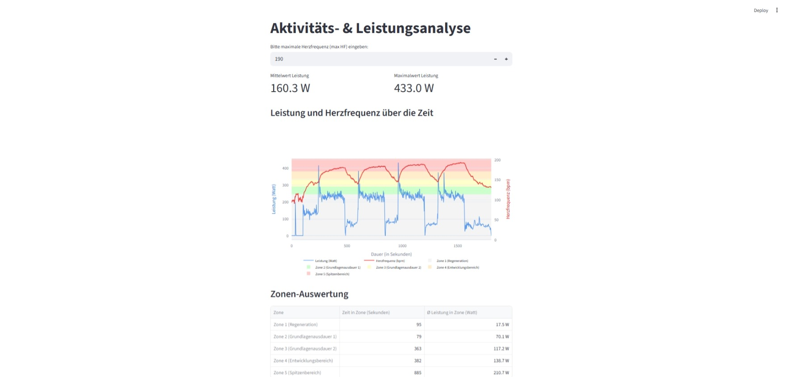

# Interaktive Aktivitäts- & Leistungsanalyse

Dieses Streamlit-Projekt dient der sportwissenschaftlichen Auswertung von Leistungsdaten (in Watt) und der Herzfrequenz (in bpm) aus einem Belastungstest. Die Daten werden sekündlich eingelesen, in fünf physiologische Belastungszonen eingeteilt und interaktiv visualisiert.

# Funktionen
* Duale Y-Achsen-Visualisierung: Leistung (Watt) und Herzfrequenz (bpm) sauber getrennt in einem Plotly-Diagramm.
* Dynamische Zonenbänder: Farbliche Hinterlegung der 5 Herzfrequenz-Zonen basierend auf der individuellen maximalen Herzfrequenz des Nutzers.
* Zonenspezifische Auswertung: Tabellarische Übersicht über die exakte Verweildauer (in Sekunden) und die durchschnittliche erbrachte Leistung pro Zone.

# Verwendete Bibliotheken & Installation

Für dieses Projekt wurden die folgenden Python-Bibliotheken verwendet:
* Streamlit
* Pandas
* Numpy
* Plotly

Das Projekt verwendet das pip-Paketmanagementsystem. Alle oben genannten Bibliotheken können automatisch mit einem einzigen Befehl heruntergeladen und installiert werden.

1. **Bibliotheken herunterladen und installieren:**
   ```bash
   pip install


2. Streamlit App starten:
    ```bash
    streamlit run main.py


